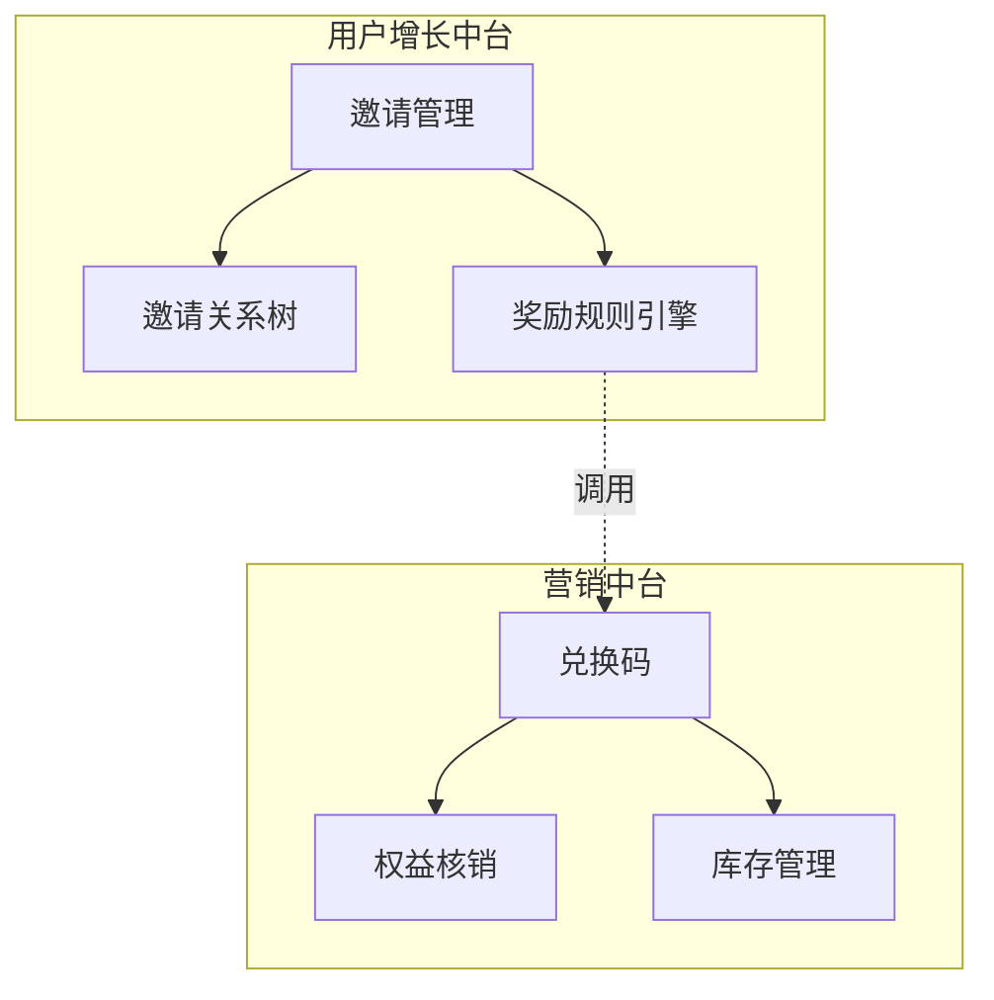

# user-grouth-service

用户增长中台, 关注增长实验（A/B、裂变、用户行为触发）

### 功能归属判断

营销中台是否包含邀请好友

1. 业务本质分析：

邀请好友属于「用户增长体系」，核心指标是拉新转化

兑换码属于「权益激励体系」，核心是促活/付费转化

两者虽都与营销相关，但处在用户旅程的不同阶段

2. 架构方案

邀请好友应归属用户增长中台
与营销中台的关系：邀请奖励可调用营销中台的兑换码/优惠券能力
